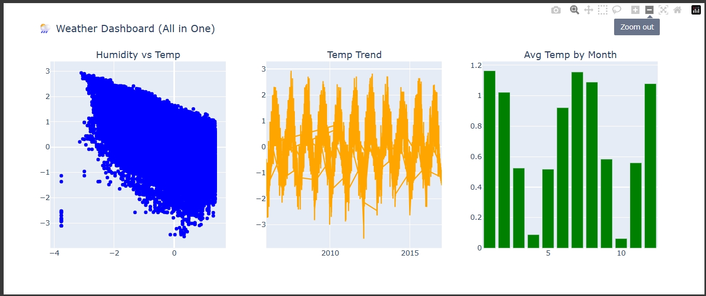

# 🌦 Weather-Dashboard

This project analyzes **historical weather data** using Python. It includes **data cleaning, exploratory analysis, machine learning models**, and an **interactive dashboard** for visualization.

---

## 📸 Project Screenshots

### Dashboard Output




---

## 🚀 Features

* ✅ Data Cleaning & Preprocessing
* ✅ Exploratory Data Analysis (EDA)
* ✅ Machine Learning Models (Logistic Regression & Random Forest)
* ✅ Performance Evaluation (Accuracy, Precision, Recall, F1)
* ✅ Interactive Dashboard with Plotly (Scatter, Line, Bar)

---

## 🛠️ Technologies Used

* **Python** 🐍
* **Pandas, NumPy** → Data Handling
* **Matplotlib, Seaborn, Plotly** → Visualization
* **Scikit-learn** → Machine Learning Models
* **Jupyter Notebook / Python Script**

---

## 📂 Project Structure

```
weather-analysis-dashboard/
│── weatherHistory.csv         # Dataset
│── 01_weather_project.ipynb            # Jupyter Notebook (full code)

│── README.md                  # Documentation
│── requirements.txt           # Dependencies
│── images/
    └── dashboard.png          # Screenshot of dashboard
```

---

## ⚙️ Setup Instructions

1. **Clone the repository**

```bash
git clone https://github.com/sanyagupta31/Weather-Dashboard.git
cd Weather-Dashboard
```

2. **Install dependencies**

```bash
pip install -r requirements.txt
```

3. **Run Jupyter Notebook**

```bash
jupyter notebook analysis.ipynb
```

---

## 📊 Results

* **Random Forest Accuracy:** \~`0.85+` (depends on data split)
* **Logistic Regression Accuracy:** lower than RF
* **Key Insight:** Random Forest performs better for predicting precipitation type.

---

## 📌 Future Improvements

* Add more weather prediction models
* Deploy dashboard using **Streamlit** or **Dash**
* Add 5-day forecast analysis

---

## 🤝 Contributing

Pull requests are welcome. If you'd like to add features, fork this repo and raise a PR.

---

## 📜 License

This project is licensed under the **MIT License**.

---

